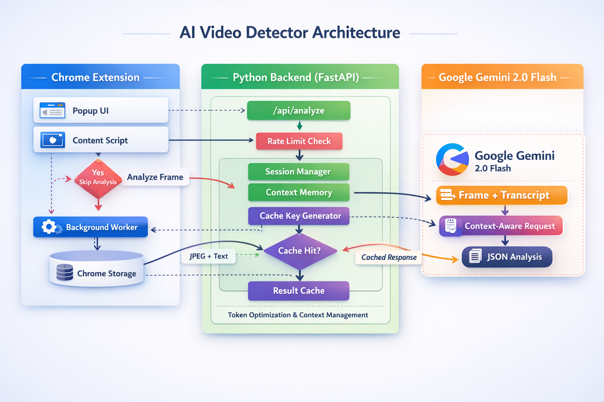

# AI Video Detector Project

This repository hosts the **Context-Aware AI Video Detector**, a Chrome Extension powered by **Google Gemini 2.0 Flash** that analyzes YouTube videos in real-time.

## 📂 Repository Structure

- **ChromeAIExtension/**: The main project directory.
    - **yt-email-extension/**: The Chrome Extension source code (Frontend).
    - **Gemini-Server/**: The Python API Server (Backend).
    - **ARCHITECTURE.md**: Detailed system architecture and data flow.

## 🚀 Quick Start

To run this project, you need to set up both the backend server and the Chrome extension.

**See [ChromeAIExtension/README.md](ChromeAIExtension/README.md) for full installation and usage instructions.**

## 📚 Architecture

The system uses a hybrid approach:
1.  **Extension**: Captures video frames and scrapes subtitles.
2.  **Server**: Maintains conversation context and queries Gemini API.
3.  **Gemini 2.0**: Provides multimodal analysis (Video + Text).

For a deep dive, check out [ARCHITECTURE.md](ChromeAIExtension/ARCHITECTURE.md).
